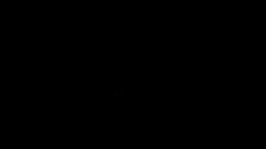

# **Лабораторная работа №3**

## Задание
Целью данной работы является поиск движещуегося объекта на видео при неподвижной камере.

Необходимо:

- Обработать видео с целью лучшего распознавания объекта
- Создать маску фона
- Наложить маску на каждый кадр и выделить движущийся объект
- Выделить движущийся объект рамкой

Исходное видео:

## Ход работы

Файл лабораторной работы - [CV_LB3.ipynb](CV_LB3.ipynb)

Для выполнения лабораторной работы будем использовать методы _cv2_ для работы с видео:

- _**cv2.VideoCapture()**_ - считывание видео с файла (является объектом).
- _**cv2.VideoWriter_fourcc()**_ - задание видеокодека видео.
- _**cv2.VideoWriter()**_ - запись видео из последовательности кадров.
- _**cv2.absdiff()**_ - вычисление разницы между двумя кадрами
- _**cv2.threshold()**_ - преобразуем наше серое изображение в бинарное (создание маски).
- _**cv2.dilate()**_ и _**cv2.erode()**_ - устранения шума и улучшения маски.
- _**cv2.bitwise_and()**_ - логическое умножение двух массивов (изображений).

Если применить маски к кадрам и удалить всё лишнее, можно получить следующее:

- _**cv2.findContours()**_ - находит контуры объектов на бинарном изображении.
На вход подается обработанное изображение, метод поиска контуров (в нашем случае - _cv2.RETR_EXTERNAL_ - поиск внешнего контура), метод аппроксимации контура (в нашем случае - _cv2.CHAIN_APPROX_SIMPLE_ - упрощение контура до основных ключевых точек).
- _**cv2.rectangle()**_ - рисует прямоугольник на изображении.

В итоге всех операций мы получаем итоговое видео с рамкой на объекте:

